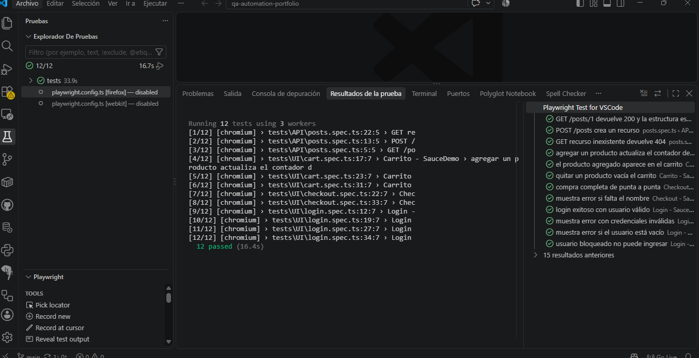

# QA Automation Portfolio

Suite de pruebas automatizadas con **Playwright y TypeScript**, que cubre flujos de interfaz (UI) y pruebas de API. Los tests corren automáticamente en **GitHub Actions** en cada push.

## Qué cubre

**UI** — [SauceDemo](https://www.saucedemo.com)
- Login: acceso exitoso, credenciales inválidas, campo vacío y usuario bloqueado.
- Carrito: agregar y quitar productos, contador y contenido.
- Checkout: compra completa de punta a punta y validación de campos obligatorios.

**API** — [JSONPlaceholder](https://jsonplaceholder.typicode.com)
- GET de recurso y de lista, POST de creación y caso negativo (404).

## Tecnologías

Playwright · TypeScript · Node.js · GitHub Actions · Page Object Model

## Estructura

pages/        Page Objects (Login, Inventory, Cart, Checkout)
tests/UI/     Tests de interfaz
tests/api/    Tests de API
.github/      Workflow de CI

## Cómo ejecutarlo

    git clone https://github.com/mluli/qa-automation-portfolio.git
    cd qa-automation-portfolio
    npm install
    npx playwright install
    npx playwright test
    npx playwright show-report

## Reporte de ejecución

## Pipeline de CI

## Autora

**Luciana Diaz** — QA Engineer · [LinkedIn](https://www.linkedin.com/in/marialucianadiaz/) · mlucianadiaz@gmail.com
